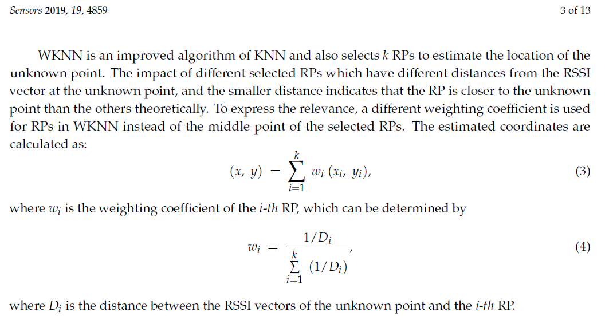

# Fingerprint

1. 사전작업
  1.1. 주어진 영역을 M-by-N의 cell-block으로 구분
  1.2. 각 cell-block에서 주변 AP들의 RSS 값을 듣고 기록 (여러번 측정 후 median 값 사용)
    - RSS 측정 시, cell-block의 중심에서 측정
  1.3. cell-block별 [rss1, rss2, ..., rssN] 값을 radio-map으로 저장
    - N: number of APs

2. 위치측정
  2.1. 위치를 모르는 user가 주변 AP들의 RSS 값을 측정
  2.2. radio-map의 각 cell-block의 RSS값과 비교 (Euclidean distance)
  2.3. 최소의 RSS distance (euc dist)를 가지는 cell-block 1개를 고르고, 그 중심에 있다고 예측

# KNN

1. 사전작업 : Fingerprint와 동일

2. 위치측정
  2.1. Fingerprint와 동일
  2.2. Fingerprint와 동일
  2.3. 최소의 RSS dist (euc dist)를 가지는 cell-block을 N개 고르고, N개의 cell-block 중심에 있다고 가정
    - 예측한 x 좌표 = N개의 cell-block의 x좌표의 평균
	- 예측한 y 좌표 = N개의 cell-block의 y좌표의 평균
	
# W-KNN	

1. 사전작업 : Fingerprint와 동일

2. 위치측정
  2.1. Fingerprint와 동일
  2.2. Fingerprint와 동일
  2.3. 최소의 RSS dist (euc dist)를 가지는 cell-block을 N개 고르고, 가중치를 고려하여 사용자의 위치를 예측
  

* Ref.: M. Li et al., "BLE Fingerprint Indoor Localization Algorithm Based on Eight-Neighborhood Template Matching," Sensors 2019, 19(22), 4859; https://doi.org/10.3390/s19224859
